# Hey, I'm Gustavo Henrique 👋

**Back-end Developer** · Building scalable systems, automating workflows & designing robust architectures

---

## About Me

I'm a **Back-end Developer** passionate about building systems that solve real operational problems at scale. My focus lies in process automation, data pipeline architecture, and crafting APIs that are both performant and maintainable. I enjoy working close to infrastructure — from containerized deployments to integrating local LLMs into workflows — always with an eye toward clean, purposeful engineering.

- 🔭 Currently building automation tools and internal platforms
- 🧠 Exploring local AI inference with **Ollama** for private, production-ready LLM integration
- 🐳 Strong believer in containerized, reproducible environments

---

## 🛠 Tech Stack

### Languages

### Frameworks & Libraries

### Infrastructure & Tools

---

## 🚀 Featured Projects

### 📬 Notes System — Email Automation Pipeline
> Automated email-driven note processing system built with **Python**, leveraging **IMAP/SMTP** protocols for real-time inbox monitoring and **Docker** for fully containerized deployment — eliminating manual data entry and enabling reliable, high-throughput processing of structured information flows with minimal operational overhead.

**Demo:** [Access Live System](https://api-notas-demo.onrender.com/)

---

### 🤝 Partnership Management System
> Full-stack internal platform developed with **Python/Flask** and **PostgreSQL**, featuring **OCR integration** for automatic document parsing — replacing entirely manual, spreadsheet-based workflows and centralizing partnership tracking, contract management, and operational reporting into a single, auditable system.

---

## 📊 GitHub Metrics

### Lines of Code & Languages

  
  

### 🔥 Contribution Streak

  

---

### 📈 Contribution Activity Graph

  

---

*"First, solve the problem. Then, write the code."* — John Johnson

